# AIO 導航系統操作手冊

[English version](OPERATION.md) · 設定說明：[設定手冊](CONFIG.zh-TW.md)

本手冊寫給兩類讀者：**操作**AIO 導航系統的人（啟動、對準、監看、收資料），以及要把導航輸出**串接**到自己軟體的人。安裝與設定請見[設定手冊](CONFIG.zh-TW.md)。

> 網頁介面為英文。本手冊中的介面文字（例如 **Ready**、**Start**、**Alignment**）保留原文，方便對照畫面。

目錄：

1. [系統提供的服務](#sec1)
2. [開啟儀表板](#sec2)
3. [看懂儀表板](#sec3)
4. [日常操作](#sec4)
5. [對準（Alignment）SOP](#sec5)
6. [UDP 導航輸出（資料串接）](#sec6)
7. [其他輸出：ROS 2 topic 與紀錄檔](#sec7)
8. [維護頁面（工程人員）](#sec8)
9. [問題排除](#sec9)
10. [名詞解釋](#sec10)

---

<a id="sec1"></a>
## 1. 系統提供的服務

裝置上執行的是 **AIO NAV**，一套慣性導航濾波器（IMU + GNSS，可選配里程計），以 100 Hz 輸出導航解（位置、速度、姿態）。同一台裝置上的**網頁儀表板**可以用來啟動濾波器、進行對準、監看狀態，以及下載紀錄檔。

| 服務 | 位置 | 對象 | 用途 |
|------|------|------|------|
| **導航輸出** | UDP，二進位，100 Hz | 您的應用程式 | 產品的主要輸出：位置、速度、姿態、精度與狀態旗標（第 6 節）。 |
| **產品頁面** | `http://<裝置IP>:8080` | 操作人員 | Overview、Navigation、Data 三個頁面：導航能不能用、車輛在哪裡、輸出是否正常送出。 |
| **AIO NAV 控制** | Overview 頁面 | 操作人員 | 啟動、停止、重新啟動導航濾波器（需在此裝置上開啟此功能）。 |
| **資料下載** | 產品頁面的 Data 頁 | 操作人員 | 把 AIO NAV 的紀錄檔下載到您的電腦。 |
| **維護頁面** | `http://<裝置IP>:8081`（需要密碼） | 工程人員 | 判斷問題出在系統、服務、ROS、感測器還是網路；相機與光達的即時畫面；驅動程式診斷與重新啟動；啟動與停止感測器驅動；編輯 AIO NAV 設定；終端機；bag 回放（選配模組）。 |
| **`aio-dashboard` 指令** | 裝置終端機 | 工程人員 | 啟動、停止、檢查與設定儀表板本身。 |

儀表板可以啟動與停止 AIO NAV（有開啟此功能時），並監看其他所有部分。AIO NAV 是獨立執行的：即使儀表板停止、重新啟動或瀏覽器關閉，導航仍會繼續運作。

<a id="sec2"></a>
## 2. 開啟儀表板

1. 把您的電腦接到與裝置相同的網路（通常是網路線直連，或接在感測器交換器上）。
2. 用瀏覽器（Chrome、Edge 或 Firefox）開啟 `http://<裝置IP>:8080`。在裝置上執行 `aio-dashboard urls` 可以列出網址。
3. 如果頁面打不開或顯示 **403 Forbidden**，代表這台裝置只接受特定電腦連線（設定中的 `access.allowed_clients`）。請管理員把您電腦的 IP 加入。

地圖底圖需要**您的電腦**能連上網際網路。沒有網路時，車輛位置與軌跡仍會顯示，只是底圖空白。

<a id="sec3"></a>
## 3. 看懂儀表板

### 3.1 狀態區

每個頁面最上方的彩色區塊只回答一個問題：*現在能不能使用導航輸出？* 它顯示狀態、一行說明發生什麼事、一行說明下一步該做什麼，以及（在 Overview 與 Navigation 頁面）**Start**、**Restart**、**Stop** 按鈕。紅色只保留給 AIO NAV 真的出問題的情況。

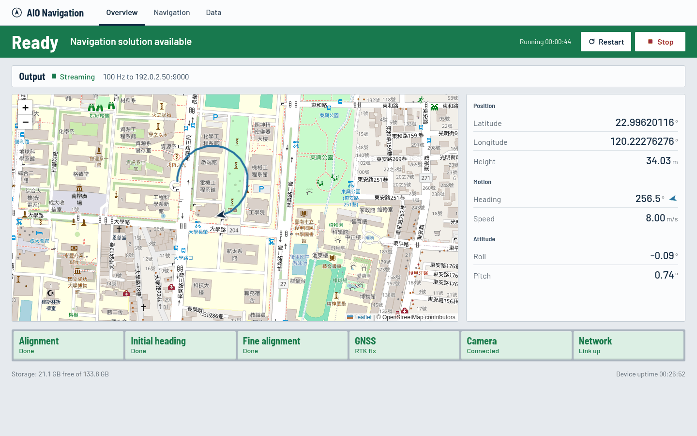
*Overview 頁面：狀態區與 AIO NAV 按鈕、輸出列、最近軌跡的地圖、位置與姿態，以及狀態燈。*


| 狀態 | 顏色 | 意義 | 該怎麼做 |
|------|------|------|----------|
| **Stopped** | 淺灰 | AIO NAV 沒有執行，也沒有人要求它執行。這是正常狀態，不是問題。 | 需要導航時按 **Start**。 |
| **Starting** | 藍綠 | AIO NAV 已啟動、正在準備，還沒有導航輸出。 | 等待。60 秒內都沒有輸出就會變成 **Fault**。 |
| **Initializing** | 琥珀 | AIO NAV 正在執行並有輸出，但對準尚未完成。會顯示目前是第幾步與該做什麼，例如「Step 1 of 3: Alignment — Keep the vehicle completely still」。 | 照著指示操作（[對準 SOP](#sec5)），此時先不要使用輸出。 |
| **Ready** | 綠 | AIO NAV 正在執行、資料即時，且對準已完成，輸出可以使用。 | 正常作業。 |
| **Fault** | 紅 | AIO NAV 出了問題：沒有人按 Stop 它卻停了、啟動後 60 秒都沒有輸出，或輸出中斷超過 2 秒。會顯示原因。 | 見[問題排除](#sec9)。 |
| **Unknown**／**Offline** | 深灰 | 儀表板剛啟動，或您的瀏覽器與裝置失去連線。 | 等幾秒；持續出現請檢查網路。 |

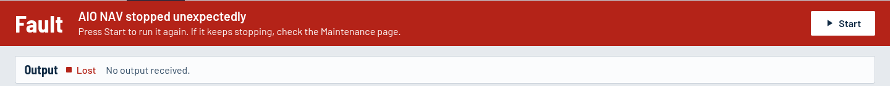
*故障時一定會說明發生什麼事，以及該怎麼做。*

狀態需要持續約 1 秒才會改變，回到 Ready 則需要穩定約 2 秒，因此偶爾掉一個封包不會讓畫面閃爍。AIO NAV 執行時，狀態區也會顯示已執行多久；處理錄好的 bag 而不是即時感測器時，會顯示 **Bag replay**。

### 3.2 狀態燈

地圖下方的燈號採用駕駛艙的慣例：**正常時安靜，需要注意時才亮起。**

| 燈號外觀 | 意義 |
|----------|------|
| 淡綠 | 正常／已完成 |
| 琥珀色全亮 | 需要注意，或仍在進行中 |
| 紅色全亮 | 故障 |
| 青色全亮 | 輔助功能正在作用中（Navigation 頁面） |
| 灰 | 沒有資料、閒置，或未設定 |

| 燈號 | 代表 |
|------|------|
| **Alignment** | 第 1 步，粗對準（調平）。 |
| **Initial heading** | 第 2 步，濾波器取得有效航向。 |
| **Fine alignment** | 第 3 步，航向精度達到目標。 |
| **GNSS** | GNSS 接收機的定位品質：**綠色** = *RTK fix*（公分級）、**琥珀色** = *RTK float*（約 10 公分，精度較差）、**紅色** = *SPP*（單點定位，公尺級）或 *No signal*。琥珀與紅色只是警告：慣性導航會繼續，但精度會慢慢下降。 |
| **Camera / LiDAR**（有安裝時） | 感測器在網路上有回應。「Not set up」代表沒有設定 IP；不需要時屬正常。 |
| **Network** | 感測器網路連線正常。 |
| **ZUPT / ZIHR / NHC / VUPT**（Navigation 頁面） | 濾波器此刻使用了哪些輔助（見[名詞解釋](#sec10)）。青色 = 作用中，灰色 = 閒置；閒置是正常的。 |

三顆對準燈依序代表三個步驟：**Done**（淡綠，已完成）、**In progress**（琥珀，目前這一步）、**Waiting**（灰，之後的步驟），AIO NAV 沒有輸出時顯示 **—**。

GNSS、相機、光達與網路的問題會以**提示**（燈號下方的琥珀色橫條）呈現，永遠不會讓狀態從 Ready 變成 Fault，因為導航解仍然可用。GNSS 燈為紅色時，會多一則提示「GNSS: SPP」或「GNSS: No signal」。

### 3.3 輸出列

狀態區下方的一行說明導航輸出（UDP，第 6 節）有沒有在送、頻率多少、送到哪裡，例如「Streaming · 100 Hz to 192.0.2.50:9000」。

| 標示 | 意義 |
|------|------|
| **Off** | AIO NAV 已停止，所以不會送出任何資料。正常。 |
| **Waiting** | AIO NAV 正在啟動，還沒有送出資料。 |
| **Streaming** | 裝置正以預期頻率送出導航封包。 |
| **Low rate** | 有送出封包，但頻率低於預期的 80%。 |
| **Stale** | 超過 0.5 秒沒有封包。 |
| **Lost** | AIO NAV 應該在送卻超過 2 秒沒有封包，狀態變成 Fault。 |

UDP 沒有回應確認：「Streaming」代表裝置有在送，不代表您的應用程式一定有收到。

### 3.4 各頁面

- **Overview**：狀態區與 AIO NAV 按鈕、輸出列、顯示最近 60 秒軌跡的地圖、位置、航向（附箭頭，上方為北）、速度、橫滾角與俯仰角、燈號、提示、儲存空間。
- **Navigation**：顯示本次執行完整軌跡的大地圖，以及每個數值與其精度（±）：位置、北／東／天速度、速率、姿態、NAV 時間。下方是輔助燈號與輸出列（含封包數）。**Show whole trajectory** 會縮放到整條軌跡；**Follow vehicle** 會重新跟隨車輛。
- **Data**：AIO NAV 的紀錄資料夾。點資料夾開啟，按 **Download** 存檔。此頁面無法更動裝置上的任何檔案。

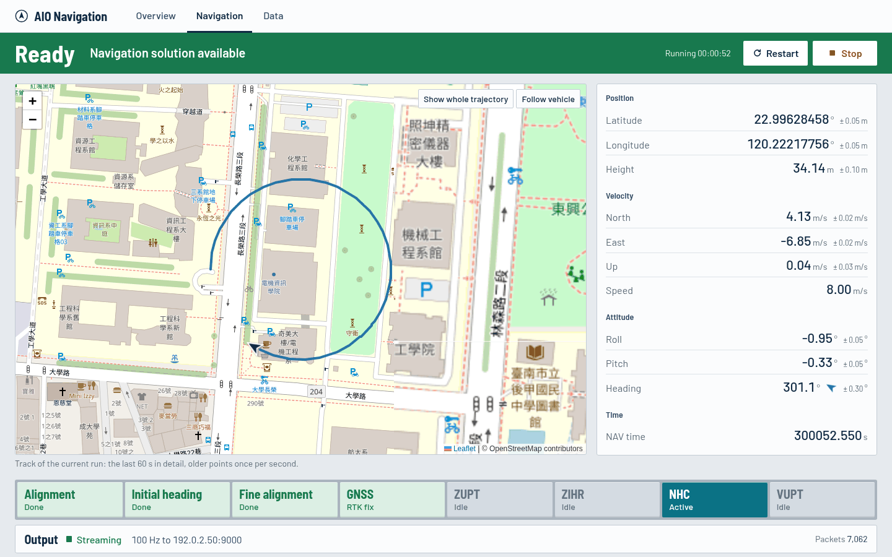
*Navigation 頁面：本次執行的完整軌跡、每個數值與其精度、輔助燈號。*

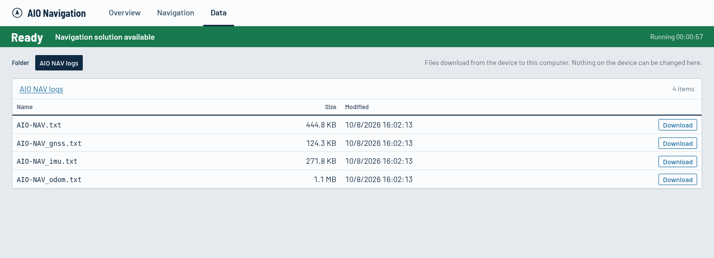
*Data 頁面：下載 AIO NAV 的紀錄檔。*

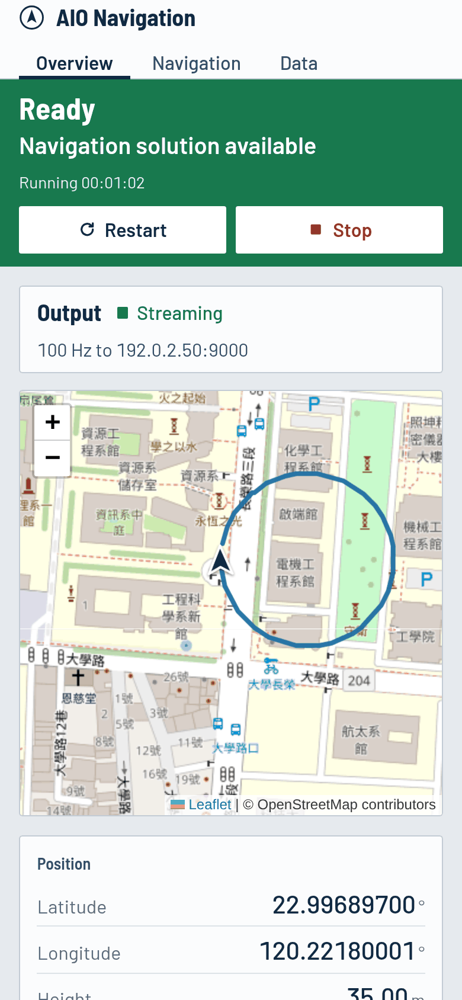

*頁面在手機與平板上也能使用。*


<a id="sec4"></a>
## 4. 日常操作

### 4.1 開始前

- [ ] 裝置已通電，GNSS 天線上方視野開闊。
- [ ] 車輛停在起始位置，對準的第一階段會**完全靜止**。
- [ ] 即時作業：模式是 **Live**，且感測器驅動正在執行（第 4.6 節；維護頁面 → ROS 2）。
- [ ] 您的電腦可以開啟產品頁面（第 2 節）。
- [ ] 狀態區顯示 **Stopped**（或執行中的狀態），而不是 Unknown／Offline：儀表板已連線。

### 4.2 啟動 AIO NAV

**Start** 按鈕在 Overview 與 Navigation 頁面最上方的狀態區。

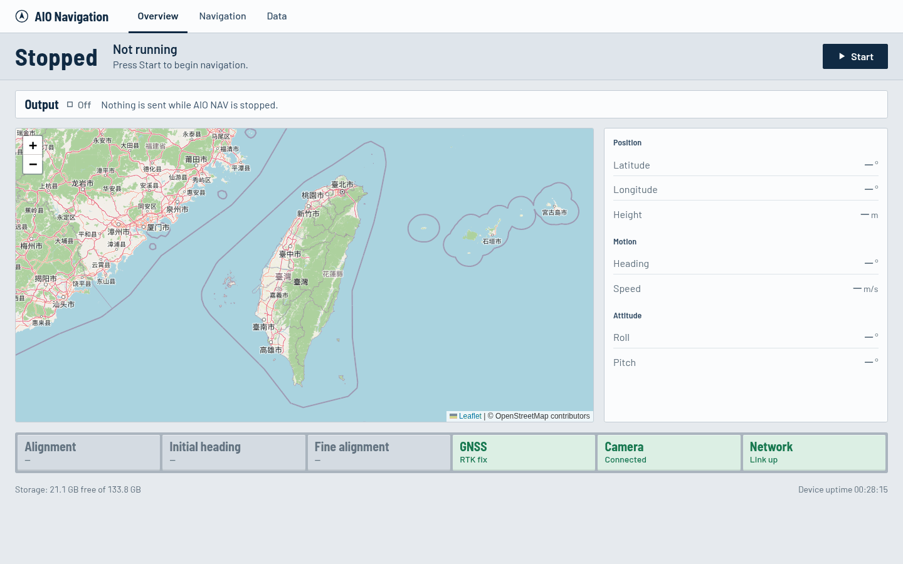
*Stopped：沒有任何問題，只是 AIO NAV 還沒執行。按 Start 即可。*


1. 按 **Start**。狀態先變成 **Starting**（藍綠），AIO NAV 一開始輸出就變成 **Initializing**（琥珀）；輸出列從 **Off** 變成 **Streaming**。
2. 照著狀態區顯示的步驟操作（[對準 SOP](#sec5)）。

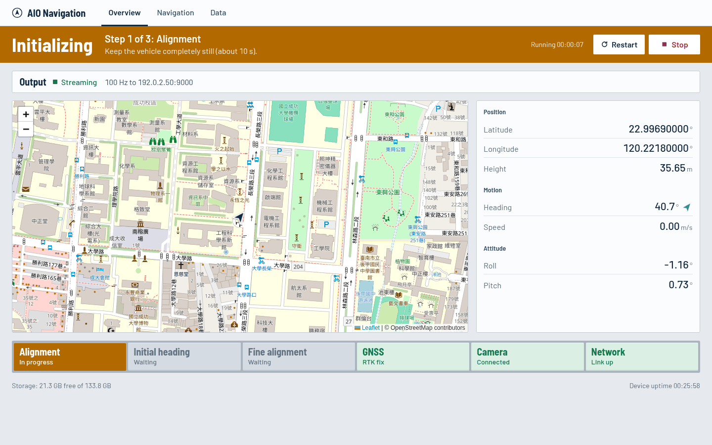
*Initializing：狀態區會寫出目前的對準步驟與該做什麼；目前這一步的燈是琥珀色，之後的步驟是灰色。*


如果狀態變成 **Fault**「AIO NAV stopped unexpectedly」，或按鈕下方的訊息是「AIO NAV did not start: …」，請見[問題排除](#sec9)。如果沒有按鈕，代表此裝置關閉了網頁控制功能（`nav.allow_control`），請管理員開啟。用其他方式啟動的 AIO NAV 也偵測得到。

### 4.3 作業中

- 留意狀態區，**Ready** 代表輸出可以使用。
- 琥珀色提示（例如「GNSS: SPP」或「GNSS: No signal」）不會中斷導航，但精度會下降。請到 Navigation 頁面查看 ± 值。
- 狀態變成 **Fault** 時，依狀態區顯示的原因處理（見[問題排除](#sec9)）。

### 4.4 重新啟動或停止

- **Restart**（會先確認：按 **Restart now**，或按 **Cancel**／Esc 取消）：停止後再啟動 AIO NAV。**對準會重新開始**，請在車輛可以靜止時才重新啟動。
- **Stop**（會先確認：按 **Stop now**，或按 **Cancel**／Esc 取消）：結束導航輸出，您的應用程式將收不到資料。

### 4.5 作業結束後

1. 停車；若不再需要導航輸出，按 **Stop**。
2. 開啟 **Data** 頁面，下載本次的紀錄檔（第 7.2 節）。

### 4.6 播放錄好的 bag（工程人員）

Bag 回放屬於選配的 **replay 模組**（安裝時加 `--with-replay`：`sudo deploy/install.sh --user <使用者> --with-replay`）。沒有安裝時，機器固定以 **Live** 執行，以下步驟不可用。

所有操作都在維護頁面 → **Replay**：

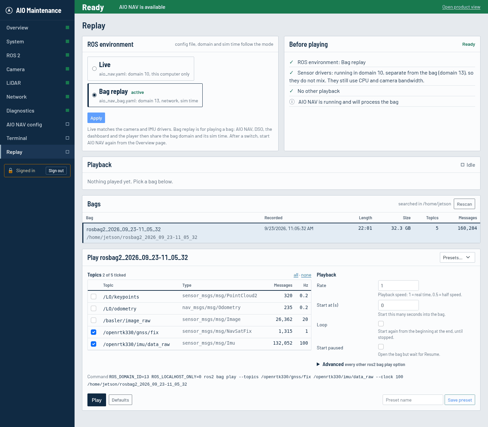
*Replay 頁面：ROS 環境、播放前的檢查、找到的 bag，以及播放設定與實際指令。*


1. **Before playing** 列出播放前必須滿足的條件，每一項都有一個處理按鈕：
   - ROS 環境是 **Bag replay**（按 *Switch to Bag replay*：AIO NAV 與 DSO 會被停止，儀表板會重新啟動，約幾秒鐘）。Bag replay 使用 `aio_nav_bag.yaml`（ROS domain 13、模擬時間），而不是 `aio_nav.yaml`（domain 10，僅限本機）；
   - 感測器驅動沒有在 bag 的 domain 發布資料。驅動平常在 Live 的 domain（10），bag 的 domain（13）看不到它們，所以可以繼續執行（只是仍會佔用 CPU 與相機頻寬）。只有當驅動在 bag 的 domain 執行、或讀不到它的 domain 時，才需要停止（按 *Stop Sensor drivers*）；
   - 目前沒有其他 bag 在播放。
2. 到 Overview 頁面按 **Start**，讓 AIO NAV 處理 bag 的資料（沒有啟動 AIO NAV 也能播放，但不會有任何計算結果）。
3. 在 **Bags** 點選一個 bag。清單列出設定的資料夾中找到的所有 bag（預設：家目錄，往下兩層），並顯示錄製時間、長度、大小與 topic。
4. 勾選要播放的 **topic**（都不勾：全部播放），再設定 **Rate**（速率）、**Start at**（起始秒數）、**Loop**（循環）與 **Start paused**（暫停開始）。**Advanced** 裡有 `ros2 bag play` 的其他所有參數（`/clock` 頻率、延遲、預讀佇列、topic 重新對應、儲存外掛、QoS 覆寫檔、儲存設定檔、等待全部確認、loaned message、記錄層級）。下方會顯示實際執行的指令，也可以直接貼到終端機使用。
5. 按 **Play**。**Playback** 會顯示估計的播放位置，並提供 **Pause**／**Resume**、播放中調整 **Rate**，以及 **Stop**。播放器的輸出在 *Player output*。
6. **Save preset** 會把 bag 連同 topic 與參數存成一組常用設定，下次從 **Presets…** 選取即可。每個 bag 上次使用的設定也會自動記住。
7. 要回到即時作業：**Stop** 停止播放，在同一頁把 ROS 環境切回 **Live**，如果之前停了感測器驅動就再啟動（維護頁面 → ROS 2；約 15 秒後開始發布資料），再到 Overview 頁面按 **Start**。

改用終端機播放時，要指定 bag 的 domain 並帶上時鐘，因為終端機的預設環境可能是別的 domain（可用 `echo $ROS_DOMAIN_ID` 確認）：
```bash
ROS_DOMAIN_ID=13 ROS_LOCALHOST_ONLY=0 ros2 bag play <bag 資料夾> --clock 100
```

<a id="sec5"></a>
## 5. 對準（Alignment）SOP

對準是濾波器在輸出可信之前，求出初始姿態（橫滾、俯仰、航向）與位置的過程。共分三個階段，分別以三顆燈號顯示。

### 5.1 三個階段

| 階段 | 轉綠的燈號 | 濾波器在做什麼 | 操作人員動作 |
|------|-----------|----------------|--------------|
| 1. 粗對準（調平） | **Alignment** | 量測重力以求出橫滾與俯仰；初始位置取自 GNSS。 | 車輛保持**完全靜止**（引擎可以發動，但車上車旁都不要有人走動）。預設時間 10 秒。 |
| 2. 初始航向 | **Initial heading** | 求出航向。預設設定下，航向是在車輛移動時由 GNSS 求得。 | **Alignment** 轉綠後，在開闊天空下以穩定速度**直線**行駛，直到此燈轉綠。 |
| 3. 精對準 | **Fine alignment** | 持續修正航向與感測器誤差，直到航向精度在 1° 以內，或超過精對準的時間上限（預設 300 秒）。 | 在有 GNSS 的環境正常行駛，包含幾次轉彎與加減速。 |

此裝置要求的燈號全部轉綠後（預設是三顆都要），狀態區就會變成 **Ready**。

### 5.2 操作步驟

1. 把車停在開闊天空下的起點。等 GNSS 燈顯示 **RTK fix**（綠色）再開始，因為初始位置取自 GNSS。**RTK float**（琥珀色）也可以，但起始精度較差。
2. 在 Overview 頁面按 **Start**，經過 **Starting** 後，狀態變成 **Initializing**：「Step 1 of 3: Alignment — Keep the vehicle completely still」。
3. **至少 10 秒不要移動**，直到 **Alignment** 燈轉為淡綠。靜止期間 Navigation 頁面的 **ZUPT** 會顯示作用中，這是正常的。
4. 直線前進，保持穩定速度，等 **Initial heading** 轉綠。
5. 繼續行駛並轉幾個彎，直到 **Fine alignment** 轉綠。到 Navigation 頁面確認航向 ± 約在 1° 以內。
6. 狀態區顯示 **Ready**，導航輸出可以使用。

### 5.3 對準不順利時

| 狀況 | 處理方式 |
|------|----------|
| 第 1 階段時車輛移動了 | 停車，按 **Restart**，從步驟 3 重新開始。 |
| **Alignment** 超過 10 秒很久仍是琥珀色 | 檢查 GNSS 燈（初始位置來自 GNSS，不應為紅色），並確認車輛真的完全靜止，然後重新啟動。 |
| 行駛中 **Initial heading** 一直沒有轉綠 | GNSS 可能被遮蔽（樹木、建築、隧道），請到開闊處行駛。 |
| **Fine alignment** 很久才完成 | 最晚會在精對準時間上限（預設 300 秒）到達時完成。請持續在開闊天空下行駛。 |
| Ready 之後 GNSS 中斷 | 導航改由慣性感測器繼續（僅為提示），精度會隨時間下降，請留意 ± 值。 |

> 對準方式與時間設定在 AIO NAV 自己的設定檔（`aio_nav.yaml` 的 `Alignment` 區段）：`coarse_duration`（預設 10 秒）、`fine_duration`（300 秒）、`fine_heading_std_threshold`（1°），以及姿態初始化選項（都可以在維護頁面 → **AIO NAV config** 修改）。若設定 `att.option: 2`，航向改由設定檔給定、不需行駛，第 2 階段便不需要移動。哪些燈號必須亮起才算 Ready，由儀表板設定中的 `nav.ready_requires` 決定。求出航向所需的最低速度與距離取決於導航函式庫，請向導航團隊確認您車輛適用的數值。

<a id="sec6"></a>
## 6. UDP 導航輸出（資料串接）

### 6.1 概要

| 項目 | 內容 |
|------|------|
| 傳輸方式 | IPv4 UDP，每個時刻一個封包，沒有回應確認 |
| 頻率 | `aio_nav.yaml` 的 `output_rate`（預設 100 Hz） |
| 封包 | 156 位元組，二進位，little-endian |
| 目的地 | 裝置本機的 `127.0.0.1:9000`（儀表板使用）**以及**一個外部 `host:port`（`aio_nav.yaml` 的 `output_udp`） |
| 開始時間 | AIO NAV 一執行就開始送，**在對準完成之前**就會送出。請用旗標判斷資料何時有效。 |

每個目的地都會收到一份完整的封包，您的接收程式和儀表板不會互搶資料。儀表板是 `127.0.0.1:9000` 唯一的監聽者：同一個位址只能有一個程式使用，所以請不要在那裡再跑別的接收程式（例如舊的 AIO Nav 桌面程式），否則儀表板會收不到資料。

### 6.2 設定目的地

1. 在維護頁面 → **AIO NAV config**（第 8 節）把 **UDP destination** 設成您電腦的 IP 與 port（例如 `192.0.2.50:9000`）。請改您使用的模式對應的檔案：`aio_nav.yaml`（Live）與 `aio_nav_bag.yaml`（Bag replay）；兩種都用的話，兩個檔案都要改。也可以直接在裝置上編輯檔案：
   ```bash
   nano ~/aio-nav-ros/install/aio_nav_ros/share/aio_nav_ros/config/aio_nav.yaml
   ```
   ```yaml
   output_udp: "192.0.2.50:9000"     # 您電腦的 IP 與 port
   ```
2. 重新啟動 AIO NAV（設定頁面的 **Save and restart AIO NAV**，或 Overview 頁面的 **Restart**）。儀表板的 **Output** 列會在幾秒內自動跟上檔案的內容。
3. 在接收端電腦的防火牆開放該 UDP port。

外部目的地**只能設定一個**，且必須是單一 IPv4 位址（unicast）。若有多個應用程式要使用，請由一台電腦接收後再轉送。

### 6.3 封包結構

| 位元組 | 欄位 | 型別 | 值 |
|--------|------|------|----|
| 0–1 | 同步碼 | 2 × uint8 | `0x55 0xAA` |
| 2 | 訊息 ID | uint8 | `0x04`（導航解） |
| 3–4 | 資料長度 | uint16 | `150` |
| 5–154 | 資料內容 | 150 位元組 | 見 6.4 |
| 155 | 檢查碼 | uint8 | 第 2–154 位元組的總和取 256 的餘數 |

同步碼、ID、長度或檢查碼任一不符的封包都應丟棄。

### 6.4 資料欄位

位移從封包開頭起算（資料內容從第 5 位元組開始）。資料內容的 Python `struct` 格式為 `<Qdd28fH3f`。

| 位移 | 欄位 | 型別 | 單位 | 說明 |
|-----:|------|------|------|------|
| 5 | 時間 | uint64 | µs | GPS 週秒 × 10⁶（每週歸零）。回放 bag 時跟隨回放時鐘。 |
| 13 | 緯度 | float64 | 度 | WGS84 |
| 21 | 經度 | float64 | 度 | WGS84 |
| 29 | 高度 | float32 | m | AIO NAV 位置解的高度 |
| 33 | 北向速度 | float32 | m/s | |
| 37 | 東向速度 | float32 | m/s | |
| 41 | 天向速度 | float32 | m/s | **向上**為正 |
| 45 | 橫滾角 | float32 | 度 | |
| 49 | 俯仰角 | float32 | 度 | |
| 53 | 航向 | float32 | 度 | 0 = 北，90 = 東（順時針）。可能以 −180…180 送出；負值加 360 即為 0…360。 |
| 57 / 61 / 65 | 位置 σ 北／東／地向 | float32 | m | 1σ 精度 |
| 69 / 73 / 77 | 速度 σ 北／東／地向 | float32 | m/s | 1σ 精度 |
| 81 / 85 / 89 | 橫滾 σ／俯仰 σ／航向 σ | float32 | 度 | 1σ 精度 |
| 93 / 97 / 101 | 陀螺儀偏差 x／y／z | float32 | deg/h | IMU 誤差估計值 |
| 105 / 109 / 113 | 加速度計偏差 x／y／z | float32 | mg | |
| 117 / 121 / 125 | 陀螺儀比例因子 x／y／z | float32 | ppm | |
| 129 / 133 / 137 | 加速度計比例因子 x／y／z | float32 | ppm | |
| 141 | 旗標 | uint16 | — | 狀態位元，見 6.5 |
| 143 | 里程計比例 | float32 | — | 設定里程計輔助時使用 |
| 147 | 安裝俯仰角 | float32 | 度 | 感測器安裝角估計值 |
| 151 | 安裝偏航角 | float32 | 度 | |

### 6.5 狀態旗標

`flags` 只使用低位元組，且以**位元反轉**的方式送出。請先把 8 個位元反轉，再依下表判讀：

| 位元（反轉後） | 封包中的位元 | 名稱 | 為 1 時的意義 |
|----:|----:|------|---------------|
| 0 | 7 | ZUPT | 已套用零速更新（車輛靜止） |
| 1 | 6 | ZIHR | 已套用零航向角速率更新 |
| 2 | 5 | NHC | 已套用非完整約束（車輛不會側滑或垂直跳動） |
| 3 | 4 | GNSS | 本時刻已套用 GNSS 量測 |
| 4 | 3 | VUPT | 已套用里程計／車速更新 |
| 5 | 2 | ALIGN | 粗對準完成 |
| 6 | 1 | HEADING | 初始航向有效 |
| 7 | 0 | FINE | 精對準完成 |

**資料什麼時候有效？** 只有在 ALIGN、HEADING、FINE 都為 1 時才使用導航解，這和儀表板 **Ready** 的規則相同。ZUPT、ZIHR、NHC、GNSS、VUPT 每個時刻都可能不同，只表示該時刻使用了哪些輔助；GNSS 更新依 GNSS 的頻率到達，所以只有部分封包的 GNSS 位元為 1。

### 6.6 接收範例（Python 3，不需安裝額外套件）

```python
import socket
import struct

PORT = 9000                                   # output_udp 中的 port
PAYLOAD = struct.Struct("<Qdd28fH3f")         # 150 位元組，little-endian
FLAG_NAMES = ["ZUPT", "ZIHR", "NHC", "GNSS", "VUPT", "ALIGN", "HEADING", "FINE"]

def reverse_bits8(x):
    return int(f"{x & 0xFF:08b}"[::-1], 2)

sock = socket.socket(socket.AF_INET, socket.SOCK_DGRAM)
sock.bind(("0.0.0.0", PORT))
while True:
    pkt, _ = sock.recvfrom(2048)
    if len(pkt) != 156 or pkt[:3] != b"\x55\xaa\x04" or pkt[155] != sum(pkt[2:155]) & 0xFF:
        continue                              # 不是有效的 NAV 封包
    f = PAYLOAD.unpack_from(pkt, 5)
    flags = reverse_bits8(f[31])
    active = [n for i, n in enumerate(FLAG_NAMES) if flags >> i & 1]
    print(f"t={f[0] / 1e6:.3f} lat={f[1]:.8f} lon={f[2]:.8f} h={f[3]:.2f} "
          f"vn={f[4]:.2f} ve={f[5]:.2f} vu={f[6]:.2f} hdg={f[9]:.1f} {' '.join(active)}")
```

C/C++ 請使用緊密排列的 struct（`#pragma pack(push, 1)`），欄位順序依 6.4：`uint64_t time_us; double lat, lon; float alt, vn, ve, vu, roll, pitch, heading, 9 個 σ, 12 個 IMU 誤差; uint16_t flags; float odo_scale, mount_pitch, mount_yaw;`（共 150 位元組）。

### 6.7 確認串接是否正確

1. 儀表板的 **Output** 列顯示 **Streaming**，以及您電腦的位址與 port。
2. 您的接收程式以預期頻率印出封包（預設每秒 100 個）。
3. 經緯度與航向和 Navigation 頁面一致。
4. 儀表板顯示 **Ready** 時，旗標中有 ALIGN、HEADING、FINE。

<a id="sec7"></a>
## 7. 其他輸出：ROS 2 topic 與紀錄檔

### 7.1 ROS 2 topic（開發用介面）

AIO NAV 也會發布 ROS 2 topic，這些是內部開發用的介面，產品介面是 UDP 輸出。這些 topic **在粗對準完成後才會發布**。

| Topic | 型別 | 內容 |
|-------|------|------|
| `/nav/fix` | `sensor_msgs/NavSatFix` | WGS84 位置；`status.service` 帶有旗標（未反轉） |
| `/nav/odometry` | `nav_msgs/Odometry` | TWD97 位置、ENU 速度、共變異數 |
| `/nav/path` | `nav_msgs/Path` | 最近的軌跡 |
| TF `map` → `imu_link` | — | TWD97 地圖座標系下的位姿 |

ROS domain 與網路設定必須和 AIO NAV 相同：**Live** 使用 domain 10（僅限本機），**Bag replay** 使用 domain 13（網路）。維護頁面 → ROS 2 會顯示目前使用的是哪一種；不是 Live 時，Overview 會顯示 **Bag replay** 標示。

### 7.2 紀錄檔（Data 頁面）

在 `aio_nav.yaml` 啟用（`save_fusion_txt`、`save_parsed_txt`）後，AIO NAV 會在對準完成後，把以 Tab 分隔的文字紀錄寫到 aio-nav-ros 的 `output/` 資料夾（在 `install/` 旁邊；兩個設定檔都指向這裡）：

| 檔案 | 內容 |
|------|------|
| `AIO-NAV.txt`（名稱由 `fusion_txt_path` 決定） | 依輸出頻率記錄的導航解：時間、位置、速度、姿態、精度、IMU 誤差、旗標 |
| `AIO-NAV_imu.txt`、`AIO-NAV_gnss.txt`、`AIO-NAV_odom.txt` | 解析後的原始感測器輸入（`save_parsed_txt`） |

可從產品頁面的 **Data** 頁下載。

<a id="sec8"></a>
## 8. 維護頁面（工程人員）

`http://<裝置IP>:8081`。側邊欄的燈號可以一眼看出哪個頁面有問題。

| 頁面 | 用途 |
|------|------|
| **Overview** | 查看四個層面（System、Services、Data flow、Network）與目前的問題清單。每個問題都連到說明它的頁面。 |
| **System** | CPU、GPU、記憶體、磁碟、溫度、systemd 服務、網路介面。 |
| **ROS 2** | 必要節點、監看中的 topic（頻率、即時性、發布者、訂閱者）、所有 topic。此頁也有 **Sensor drivers**（啟動／停止／重新啟動相機與 IMU/GNSS 驅動），並顯示目前的 ROS 環境。 |
| **Replay**（僅安裝 replay 模組時） | 切換 Live 與 Bag replay，並以任意 `ros2 bag play` 參數播放 bag（見 4.6 節）。 |
| **Camera / LiDAR**（有安裝時） | 連線狀態、驅動程式狀態、topic 狀態、**Live view**（相機影像；光達點雲，可切換俯視／3D）、**Run diagnostic**、**Restart driver**（會先確認）。 |
| **Network** | 網路介面與位址、感測器連線狀態、導航輸出目的地與其路由。 |
| **Diagnostics** | 目前的故障與警告、診斷與重新啟動的結果，以及事件紀錄。 |
| **AIO NAV config** | 編輯 AIO NAV 的設定檔（Live 用 `aio_nav.yaml`，Bag replay 用 `aio_nav_bag.yaml`）。**Settings** 是常用設定的表單（輸出、ROS、紀錄、對準、輔助、桿臂）；**Edit file** 是整份檔案。檔案中的註解會保留。**Review changes** 會檢查檔案並列出確切的變更；接著按 **Save**，或 **Save and restart AIO NAV** 讓設定立即生效。每次儲存都會保留前一版（**Earlier versions**，可還原）。 |
| **Terminal** | 在瀏覽器中開啟裝置上的 shell，方便快速檢查（`ros2 topic hz …`、`journalctl …`、`top`）。以儀表板的使用者身分執行，並像桌面終端機一樣載入您的 `.bashrc`（所以 ROS 已設定好）；**Use active ROS domain** 會輸入目前模式的 export 指令。最多同時 3 個；30 分鐘沒有輸入會自動關閉。 |

維護頁面可以更動裝置，所以需要密碼；產品頁面不需要。密碼在裝置上以 `aio-dashboard password` 設定（沒有預設密碼：設定之前維護頁面會一直鎖住，登入頁會說明如何設定）。開啟任何維護頁面都會先顯示登入頁，登入後再回到您要開的頁面。15 分鐘沒有使用會自動登出（開啟頁面與執行操作算使用，頁面自己的定時更新不算），也可以按側邊欄最下方的 **Sign out**。登入、密碼錯誤、儲存設定與開啟終端機都會記錄在事件紀錄（Diagnostics）中。

Live view 只在該頁面開啟時才讀取感測器的 ROS topic。刻意停止的驅動不會被當成問題。

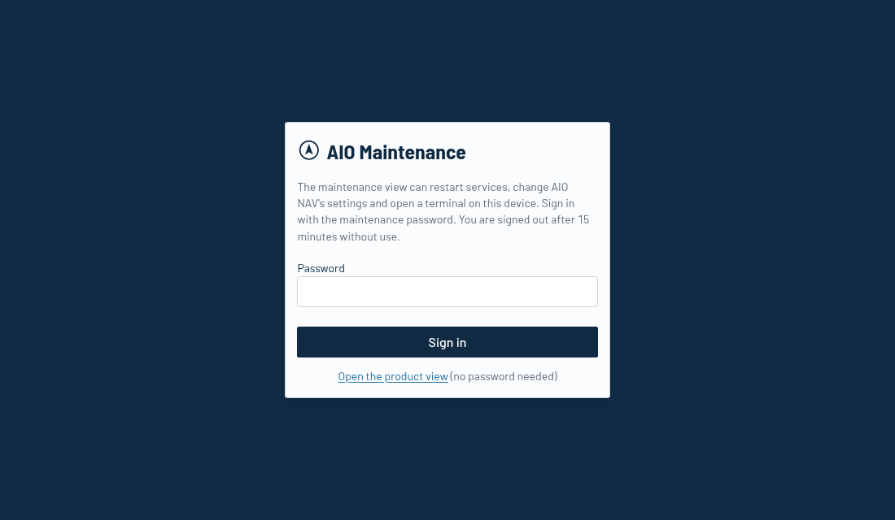
*維護頁面的登入頁。*

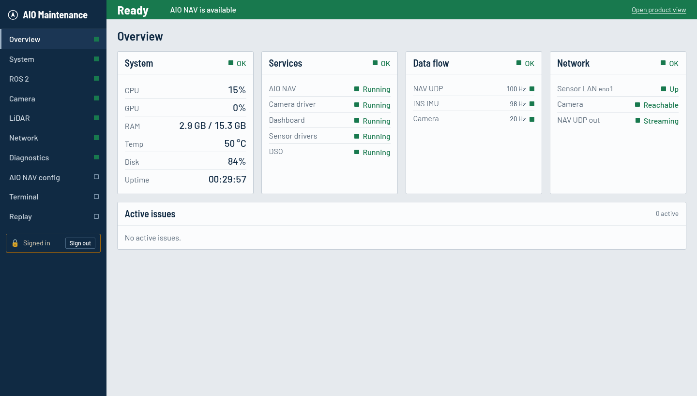
*Overview：四個層面與目前的問題。側邊欄的燈號指出哪一頁有問題；工具頁（AIO NAV config、Terminal、Replay）沒有燈號。*

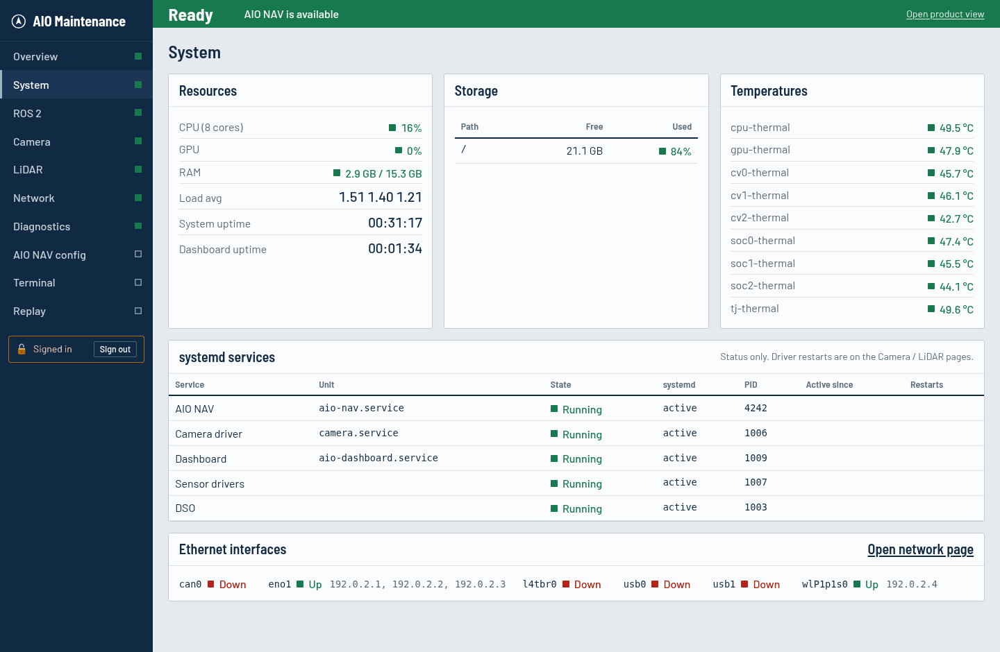
*System：資源、儲存空間、溫度與服務。*

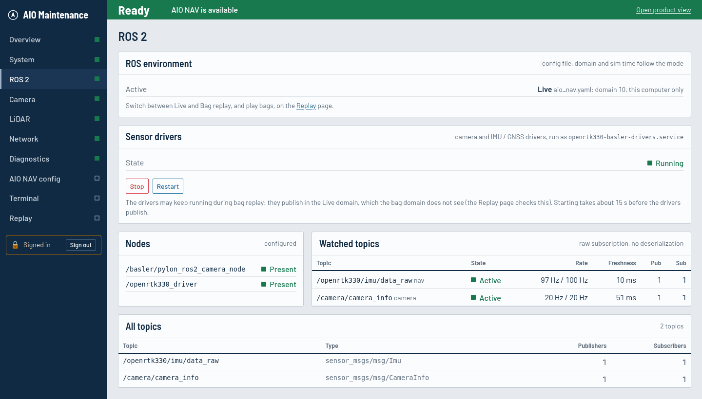
*ROS 2：目前的環境、感測器驅動（啟動／停止／重新啟動）、節點與 topic。*

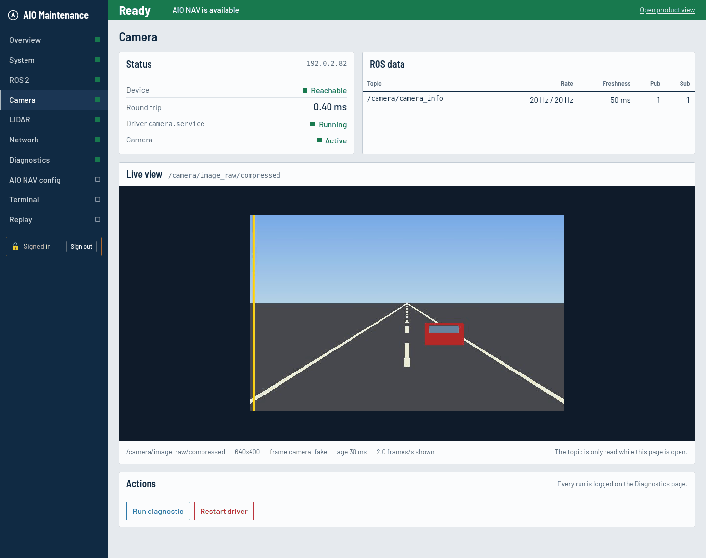
*Camera：連線狀態、驅動、topic 與 Live view（這裡是模擬畫面）。*

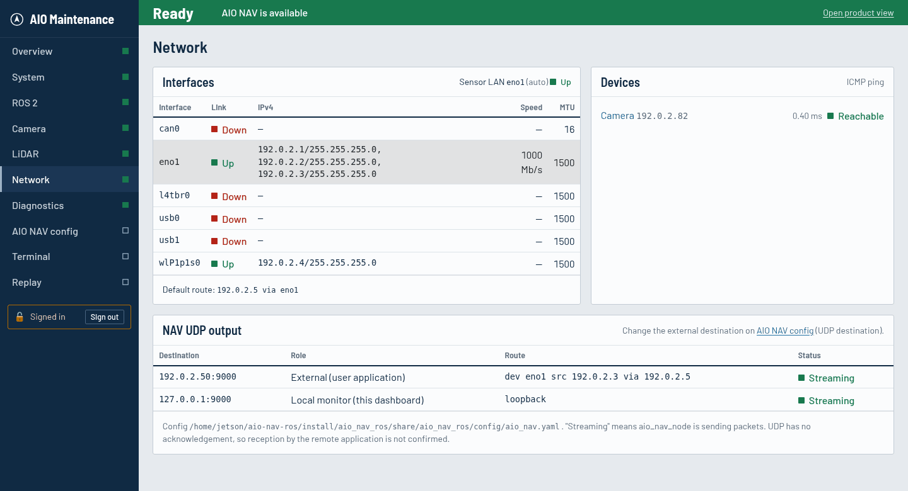
*Network：網路介面、感測器連線，以及導航輸出送往何處。*

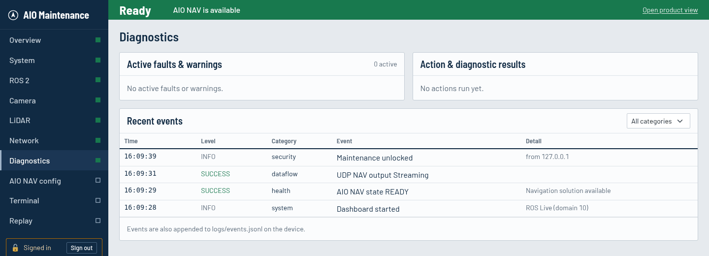
*Diagnostics：目前的問題、操作結果與事件紀錄。*

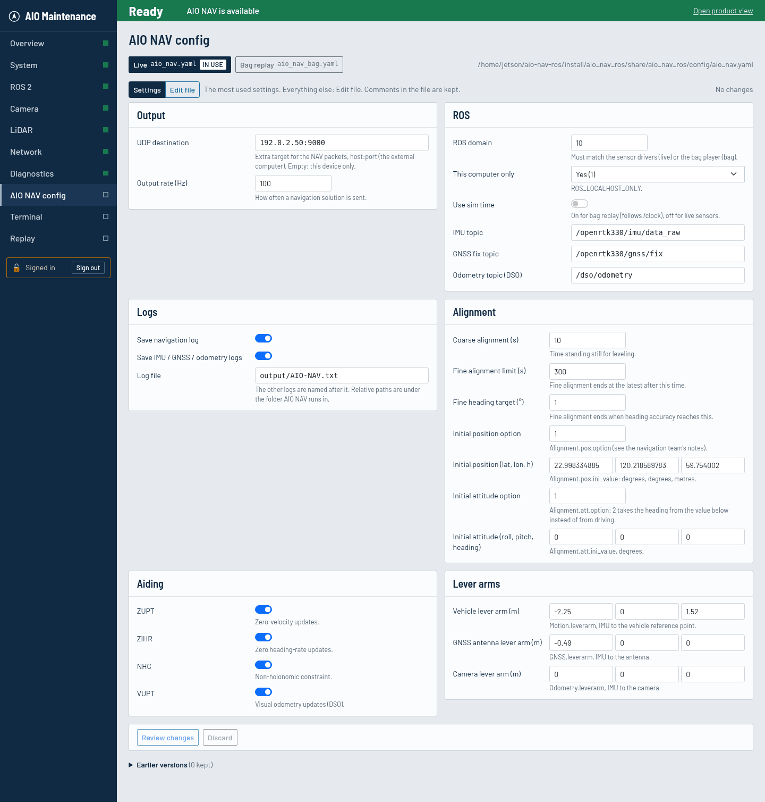
*AIO NAV config：使用中設定檔的常用設定；**Edit file** 會顯示整份檔案。*

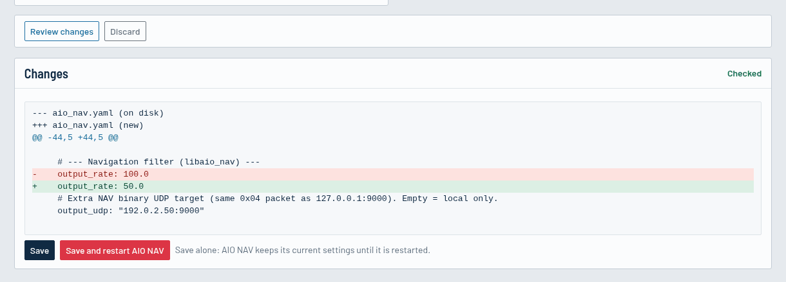
*Review changes：儲存前檢查並列出確切變更的行。*

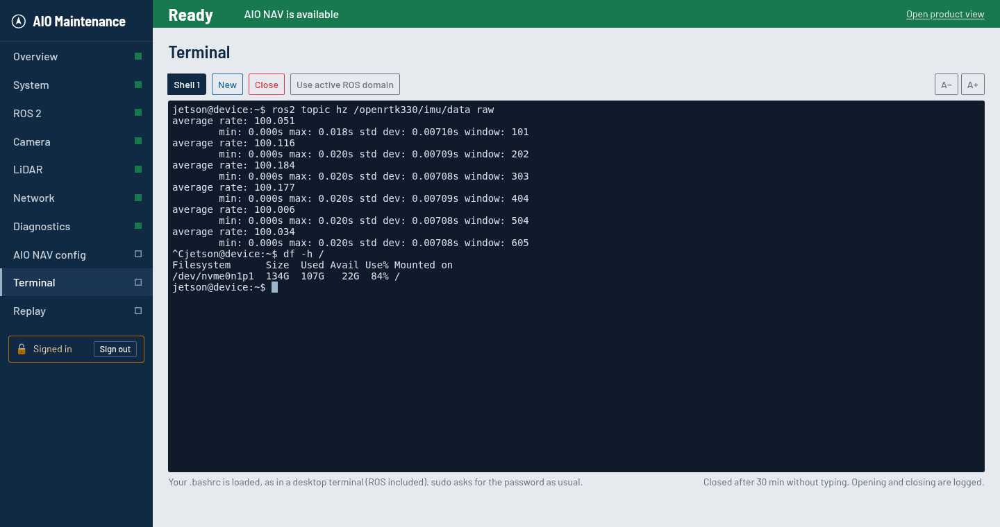
*Terminal：裝置上的 shell，例如檢查 topic 的頻率。*

裝置上的指令：

```bash
aio-dashboard status     # 服務狀態與網址
aio-dashboard logs       # 即時查看 log
aio-dashboard restart
aio-dashboard config     # 編輯設定、檢查、重新啟動
aio-dashboard password   # 設定維護頁面的密碼
```

<a id="sec9"></a>
## 9. 問題排除

| 看到的狀況 | 可能原因 | 處理方式 |
|------------|----------|----------|
| 頁面打不開 | 網址錯誤、網路問題，或儀表板沒有執行 | 確認 IP（在裝置上執行 `aio-dashboard urls`）與網路線；執行 `aio-dashboard status`。 |
| **403 Forbidden** | 您的電腦不在允許清單中 | 請管理員加入您的 IP（`access.allowed_clients`）。 |
| 維護頁面：登入頁顯示尚未設定密碼 | 還沒有設定維護密碼 | 在裝置上執行 `aio-dashboard password`，再重新整理頁面。 |
| 維護頁面：回到登入頁 | 15 分鐘沒有使用，已自動登出 | 重新登入；登入後會回到原本的頁面。 |
| 更新後頁面沒有樣式，或顯示 *Unknown* | 瀏覽器還在用舊的頁面檔案 | 按 **Ctrl+Shift+R** 重新載入。 |
| **Offline**，「Lost connection to the dashboard」 | 瀏覽器連不到裝置 | 檢查網路，恢復後頁面會自動更新。 |
| **Stopped** | AIO NAV 沒有執行（正常） | 按 **Start**（第 4.2 節）。 |
| **Fault**：AIO NAV stopped unexpectedly | AIO NAV 自己結束了 | 按 **Start**。若一直發生，請收集 `/opt/aio-dashboard/logs/aio_nav.log` 交給導航團隊（維護頁面有細節）。 |
| **Fault**：AIO NAV is running but sends no navigation output | 啟動後 60 秒內都沒有輸出（`nav.startup_timeout_s`） | **Restart** AIO NAV；到維護頁面檢查它的感測器（IMU／GNSS 驅動）。 |
| **Fault**：Navigation output stopped | 濾波器停住，或其感測器停止輸出 | 到維護頁面檢查 IMU／GNSS 驅動；**Restart** AIO NAV。 |
| 按鈕下方訊息「AIO NAV did not start: …」 | AIO NAV 結束了或無法啟動，訊息會說明原因 | 再按一次 **Start**。若重複發生，請收集 `/opt/aio-dashboard/logs/aio_nav.log` 交給導航團隊。 |
| **Fault**：AIO NAV is not installed on this device | 此裝置上 aio-nav-ros 的 `install/` 資料夾不見或不完整 | 請管理員確認 aio-nav-ros 已安裝。 |
| 即時作業：沒有相機或 IMU 資料 | 感測器驅動已停止 | 維護頁面 → ROS 2 → Sensor drivers → **Start**，等約 15 秒。 |
| Bag 回放：AIO NAV 收不到資料 | Bag 在別的 ROS domain 播放，或沒有啟動 AIO NAV | 見 4.6 節：從維護頁面 → Replay 播放（會使用正確的 domain），並在 Overview 頁面按 Start。用終端機時：`ROS_DOMAIN_ID=13 ROS_LOCALHOST_ONLY=0 ros2 bag play … --clock 100`。 |
| 一直停在 **Initializing** | 對準尚未完成 | 依照[對準 SOP](#sec5) 與 5.3 處理。 |
| 事件「DSO used too much memory: restarting DSO」（維護頁面 → Diagnostics） | DSO 的記憶體一直增加（曾發現它保留每一張相機影像），監控在機器記憶體用完之前把它重新啟動 | 不需要立即處理，AIO NAV 會繼續執行。若重複發生，請回報給 DSO 的維護者。上限是 `dso_watchdog.max_memory_mb`。 |
| **GNSS** 燈為琥珀或紅色（*RTK float*、*SPP*、*No signal*） | 天空被遮蔽、沒有 RTK 校正資料、天線或 GNSS 接收器問題 | 導航會繼續；移到開闊處；檢查天線與校正資料連線。 |
| **Low rate**／**Stale** | 裝置負載過高，或濾波器輸入中斷 | 檢查 System 頁面（CPU、溫度）與 ROS 2 頁面。 |
| 相機／光達 **Not connected** | 感測器未開機、線路問題或 IP 錯誤 | 檢查電源與線路；維護頁面 → Camera／LiDAR → **Run diagnostic**。 |
| 儀表板顯示 Streaming，但您的應用程式收不到 | 目的地或防火牆 | 確認 **Output** 列上的位址是您的電腦；在該電腦的防火牆開放 UDP port（第 6.7 節）。 |
| Data 頁面沒有檔案 | 紀錄功能未開啟，或尚未完成過對準 | 在 `aio_nav.yaml` 啟用 `save_fusion_txt`；紀錄在對準完成後才開始。 |

<a id="sec10"></a>
## 10. 名詞解釋

| 名詞 | 意義 |
|------|------|
| AIO NAV | 在裝置上執行的導航濾波器（`aio_nav_node`）。 |
| 對準（Alignment） | 導航開始前，求出初始姿態與位置的過程。 |
| GNSS | 衛星定位（GPS、Galileo、北斗等）。 |
| RTK fix／RTK float | 使用校正資料的接收機解：*fix* 為公分級，*float* 約為分米級。 |
| SPP | 沒有校正資料的單點定位：公尺級精度。 |
| Live／Bag replay | 系統的兩種模式：即時感測器（ROS domain 10）或錄好的 bag（domain 13）。 |
| IMU | 慣性量測單元：陀螺儀與加速度計。 |
| ZUPT | 零速更新：濾波器利用「車輛沒有移動」這項資訊。 |
| ZIHR | 零航向角速率：靜止時濾波器利用「航向沒有改變」這項資訊。 |
| NHC | 非完整約束：汽車不會側向滑動或垂直跳動。 |
| VUPT | 來自里程計的車速更新。 |
| σ（sigma）、± | 數值的 1σ 精度估計。 |
| TWD97 | 台灣的國家坐標系統，ROS 輸出使用此坐標。 |
| GPS 週秒 | 自 GPS 週開始（GPS 時間週日 00:00）起算的秒數。 |
